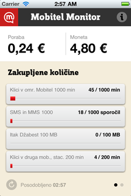
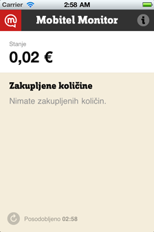
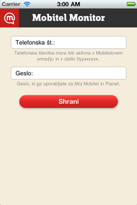

Mobitel Monitor
===============

Mobitel Monitor is an iPhone app that gives users of Slovenian carrier [Mobitel](http://www.mobitel.si/) a quick way to check their expenses:

  - Account balance (prepaid users)
  - Accrued usage in current billing interval (postpaid users)
  - Quota usage (free minutes, message, megabytes, etc.)

Screenshots
-----------

<!-- GitHub does not support relative links :/

-->

 &nbsp;
 &nbsp;
 &nbsp;

License
-------

The code is available under the [MIT license](http://en.wikipedia.org/wiki/MIT_License), which means that you can do pretty much whatever you want with it (see LICENSE.txt).

Please note, however, that you are not allowed to use Mobitel's branding without permission.

Authors
-------

Authors:

  - Jaka Jančar (code)
  - Matevž Klanjšek (UI design)

Contributors:

  - Jernej Fijačko (API compatibility fix)
